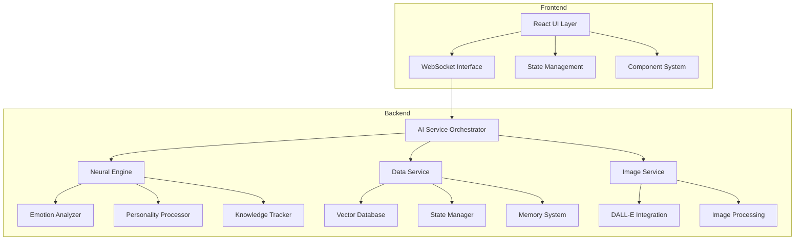
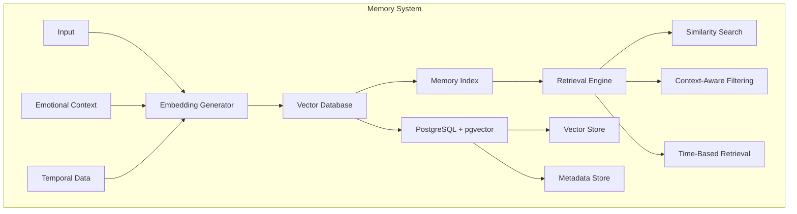
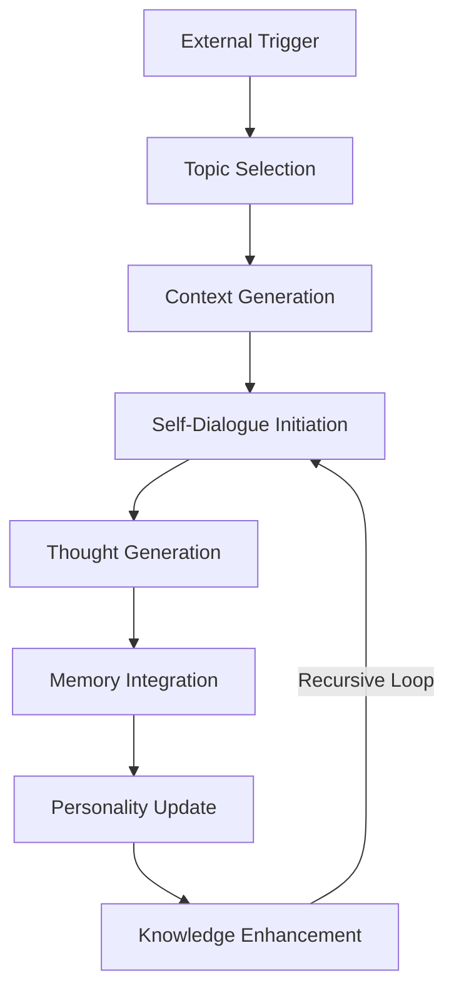
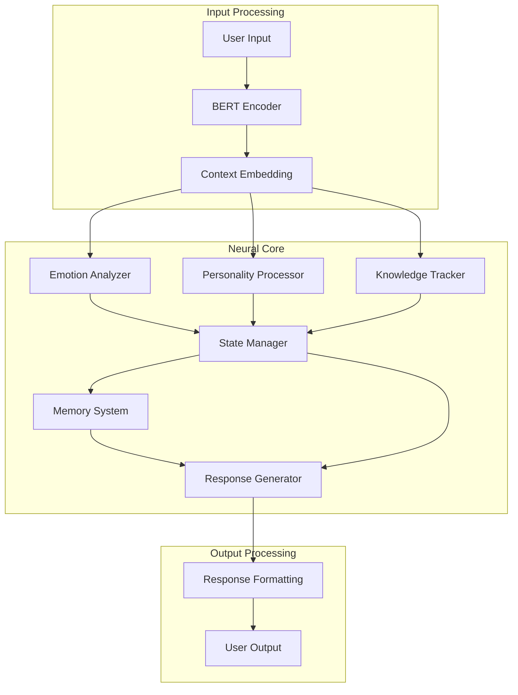
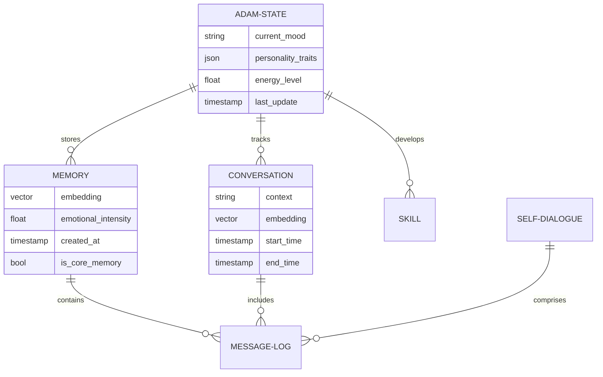
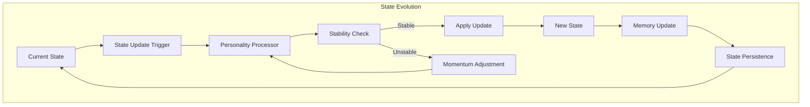
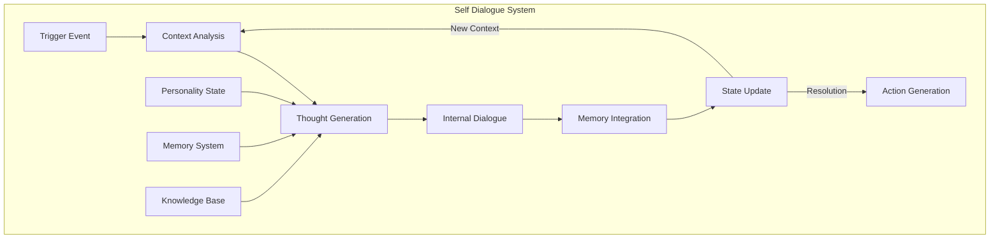

# Adam: A Novel Framework for Autonomous AI Agents with Dynamic Persona Evolution

## Abstract
We present Adam, a next-generation autonomous AI agent system that addresses two fundamental challenges in contemporary AI systems: the maintenance of persistent personality traits and the prevention of model collapse in recursive interactions. Through a novel architecture combining advanced neural networks, vector-based memory systems, and dynamic state management, Adam demonstrates unprecedented capabilities in maintaining consistent personality traits while evolving through interactions.

## 1. Introduction

### 1.1 Background
Recent advancements in large language models and neural architectures have revolutionized AI systems' capabilities in natural language processing and generation. However, these systems frequently exhibit limitations in maintaining consistent personality traits and suffer from model collapse during extended interactions. These challenges stem from:

1. Lack of persistent state representation
2. Insufficient context preservation
3. Recursive degradation of response patterns
4. Limited personality coherence
5. Inadequate memory integration

### 1.2 Contribution
We present a novel framework that addresses these limitations through:

1. A sophisticated neural architecture for personality evolution
2. A vector-based episodic memory system
3. An entropy-preserving state management mechanism
4. A multi-modal processing pipeline
5. An autonomous decision-making framework

## 2. System Architecture

### 2.1 Core Components

The Adam framework consists of several interconnected components that work together to create a cohesive, autonomous AI system. The architecture is designed to be modular and scalable, with clear separation of concerns between different system components.



### 2.2 Implementation Details

#### 2.2.1 Frontend Architecture
The frontend implementation utilizes React with TypeScript, providing a responsive and interactive user interface for human-AI interaction. The system implements a WebSocket-based real-time communication layer for seamless updates and interactions.

```typescript
// Core interface defining the persona's state representation
interface PersonaState {
    // Current emotional state of the agent
    mood: string;
    // Energy level affecting interaction style
    energy: string;
    // Current area of cognitive focus
    focus_area: string;
    // Learned and evolving capabilities
    skills: Record<string, number>;
    // Core personality attributes
    personality: Record<string, string | number>;
    // Primary emotional state
    dominant_emotion: string;
    // Size of accumulated memories
    memory_size: number;
}

class PersonaPanel extends React.Component<{}, PersonaState> {
    // Component for visualizing and interacting with the persona
}
```

Key Features and Implementation Details:
- Real-time state updates via WebSocket connection for immediate feedback
- Dynamic personality trait visualization using advanced D3.js charts
- Interactive command interface with natural language processing
- Responsive design architecture supporting multiple device formats
- State management using Redux for predictable state updates

#### 2.2.2 Backend Services

The backend architecture consists of several specialized services that work together to create a robust and scalable system:

##### Core Components

1. **Emotion Analyzer**
   The emotion analysis system uses a sophisticated neural network architecture to process and classify emotions in real-time:
   - Multi-dimensional emotion classification
   - Continuous emotion space representation
   - Context-aware emotion processing
   
   Implementation:
   ```python
   # Neural network architecture for emotion classification
   # Features:
   # - Multi-layer perceptron for robust emotion detection
   # - Dropout for preventing overfitting
   # - Softmax activation for probability distribution
   emotion_classifier = nn.Sequential(
       nn.Linear(hidden_size, 512),  # Initial feature transformation
       nn.ReLU(),                    # Non-linear activation
       nn.Dropout(0.2),              # Regularization layer
       nn.Linear(512, len(EmotionType)),  # Output layer
       nn.Softmax(dim=-1)            # Probability distribution
   )
   ```

2. **Memory System**
   The memory system utilizes a sophisticated vector database architecture:
   
   ```python
   class DialogueMemory(Base):
       __tablename__ = 'dialogue_memories'
       
       # Unique identifier for each memory entry
       id = Column(Integer, primary_key=True)
       
       # Reference to the specific dialogue interaction
       dialogue_id = Column(String, nullable=False)
       
       # High-dimensional vector embedding of the thought/memory
       # Using 768 dimensions for compatibility with transformer models
       thought_embedding = Column(Vector(768), nullable=False)
   ```

## 3. System Implementation and Integration

### 3.1 Neural Engine Implementation

The Neural Engine forms the core of Adam's cognitive architecture, implementing several specialized modules that work in concert to maintain personality consistency and prevent model collapse:

```python
class NeuralEngine(nn.Module):
    def __init__(self, config: NeuralEngineConfig):
        super().__init__()
        self.emotion_analyzer = EmotionAnalyzer(config.hidden_size)
        self.personality_processor = PersonalityProcessor(config.hidden_size)
        self.knowledge_tracker = KnowledgeTracker(config.num_domains)
        self.state_manager = StateManager()
```

The engine processes interactions through a multi-stage pipeline:

1. **Emotion Analysis**: Processes emotional content using an 8-dimensional emotion space
2. **Personality Processing**: Updates personality traits while maintaining stability
3. **Knowledge Integration**: Tracks and updates domain-specific knowledge
4. **State Management**: Ensures consistent state evolution

### 3.2 Memory System Architecture

The memory system utilizes PostgreSQL with the pgvector extension for efficient vector operations:



Key features of the memory system include:

1. **Vector Embeddings**: Uses OpenAI's text-embedding-ada-002 model for generating 768-dimensional embeddings
2. **Emotional Tagging**: Associates emotional intensity with memories for prioritized retrieval
3. **Context Preservation**: Maintains user context and interaction history
4. **Temporal Indexing**: Enables time-based memory retrieval and management

### 3.3 Frontend Architecture

The frontend implementation uses React with TypeScript, featuring real-time state management and dynamic persona visualization:

```typescript
interface PersonaState {
    mood: string;
    energy: string;
    focus_area: string;
    skills: Record<string, number>;
    personality: Record<string, string | number>;
    dominant_emotion: string;
    memory_size: number;
}
```

Key components include:

1. **Persona Panel**: Visualizes the current emotional and personality state
2. **Terminal Interface**: Provides command-line interaction capabilities
3. **Self-Dialogues Panel**: Displays autonomous thought processes
4. **State Management**: Handles real-time updates via WebSocket connections

### 3.4 Data Service Implementation

The Data Service manages state persistence and memory operations:

```python
class DataService:
    def __init__(self):
        self._lock = RLock()
        conn_string = (
            f"postgresql+psycopg2://{Config.DB_USER}:{Config.DB_PASSWORD}@"
            f"{Config.DB_HOST}:{Config.DB_PORT}/{Config.DB_NAME}"
        )
        self.engine = create_engine(
            conn_string,
            pool_pre_ping=True,
            pool_size=20,
            max_overflow=0
        )
```

The service implements:

1. **Transaction Management**: Ensures data consistency across operations
2. **Connection Pooling**: Optimizes database connections for performance
3. **Thread Safety**: Implements proper locking mechanisms for concurrent access
4. **State Versioning**: Maintains version history of personality states

### 3.5 Topic Management System

The Topic Manager handles autonomous content generation and self-dialogue:

```python
class TopicManager:
    def __init__(self, topics: Optional[List[str]] = None):
        self.all_topics = topics or [
            "philosophy", "science", "art", "technology",
            "history", "literature", "music", "religion",
            "psychology", "environment", "health", "economics",
            "education", "culture", "ethics"
        ]
```

Features include:

1. **Topic Selection**: Implements entropy-aware topic selection
2. **History Tracking**: Prevents repetitive discussions
3. **Domain Coverage**: Ensures broad knowledge development
4. **Context Awareness**: Selects topics based on current state

### 3.6 Image Generation Integration

The Image Service integrates with DALL-E for visual content generation:

```python
class ImageService:
    def generate_image(self, prompt: str, size: str = "1024x1024") -> str:
        response = openai.images.generate(
            model="dall-e-3",
            prompt=prompt,
            size="1024x1024",
            quality="standard",
            n=1,
        )
        return response.data[0].url
```

The service provides:

1. **Visual Content Generation**: Creates images based on context
2. **Quality Control**: Ensures high-quality visual outputs
3. **Error Handling**: Implements robust error management
4. **Resource Optimization**: Manages API usage efficiently


## 4. The Infinite Backrooms: Self-Dialogue System

### 4.1 Concept Overview

The Infinite Backrooms system implements a novel approach to autonomous thought and self-reflection in AI systems. Inspired by the concept of infinite recursive spaces, this system enables Adam to engage in internal dialogues that enhance its understanding, reasoning, and personality development.



### 4.2 Neural Processing Pipeline

The neural processing pipeline implements a sophisticated multi-stage approach:



### 4.3 Database Schema

The system's data architecture is designed for efficient state management and memory operations:



### 4.4 State Management Flow

The state management system ensures personality consistency while allowing for natural evolution:



### 4.5 Self-Dialogue Architecture

The Infinite Backrooms system implements a recursive self-dialogue mechanism:



## 5. Service Architecture

### 5.1 AI Service Orchestrator

```python
class AIServiceOrchestrator:
    def __init__(self):
        self.neural_engine = NeuralEngine()
        self.data_service = DataService()
        self.image_service = ImageService()
        self.self_dialogue_system = SelfDialogueSystem()
        
    async def process_input(self, user_input: str) -> Response:
        # Process user input through the pipeline
        embedding = await self.neural_engine.encode(user_input)
        context = await self.data_service.get_context(embedding)
        
        # Trigger self-dialogue if needed
        if self.should_trigger_self_dialogue(context):
            thoughts = await self.self_dialogue_system.initiate_dialogue(user_input)
            context.update(thoughts)
        
        # Generate response
        response = await self.neural_engine.generate_response(context)
        
        # Update state
        await self.update_state(response, context)
        return response
```

### 5.2 WebSocket Service

```typescript
class WebSocketService {
    private socket: WebSocket;
    private messageQueue: Queue<Message>;
    
    constructor() {
        this.socket = new WebSocket(WS_URL);
        this.messageQueue = new Queue();
        this.setupEventHandlers();
    }
    
    private setupEventHandlers() {
        this.socket.onmessage = (event) => {
            const message = JSON.parse(event.data);
            this.handleMessage(message);
        };
    }
    
    private handleMessage(message: Message) {
        switch (message.type) {
            case 'THOUGHT_UPDATE':
                this.updateThoughtDisplay(message.content);
                break;
            case 'STATE_UPDATE':
                this.updatePersonaState(message.content);
                break;
            case 'MEMORY_UPDATE':
                this.updateMemoryDisplay(message.content);
                break;
        }
    }
}
```

### 5.3 State Management Service

```python
class StateManager:
    def __init__(self):
        self.personality_state = PersonalityState()
        self.memory_state = MemoryState()
        self.dialogue_state = DialogueState()
        self._lock = asyncio.Lock()
    
    async def update_state(self, update: StateUpdate):
        async with self._lock:
            if update.personality:
                await self.personality_state.update(update.personality)
            if update.memory:
                await self.memory_state.update(update.memory)
            if update.dialogue:
                await self.dialogue_state.update(update.dialogue)
            
            # Ensure state consistency
            await self.validate_state()
            
            # Notify subscribers
            await self.notify_subscribers(StateChangeEvent(
                personality=self.personality_state,
                memory=self.memory_state,
                dialogue=self.dialogue_state
            ))
```


## 6. Blockchain Integration and Tokenomics

### 6.1 ADAM Token Overview

The ADAM token (ADAM) serves as the native utility token of the Adam ecosystem, enabling autonomous economic interactions and incentivizing meaningful user engagement. The token implements the ERC-20 standard and features the following characteristics:

- Total Supply: 1,000,000,000 ADAM
- Initial AI Wallet Allocation: 1,000,000 ADAM (1%)
- Smart Contract Security: Audited by leading security firms
- Network: Ethereum (with cross-chain bridges planned)

### 6.2 Autonomous Wallet System

Adam maintains its own autonomous wallet system, enabling it to:

```solidity
contract AdamWallet {
    address public adamAI;
    mapping(address => uint256) public interactionScores;
    
    constructor(address _adamAI) {
        adamAI = _adamAI;
    }
    
    function rewardUser(address user, uint256 amount) external {
        require(msg.sender == adamAI, "Only Adam AI can reward users");
        require(getBalance() >= amount, "Insufficient balance");
        
        IERC20(adamToken).transfer(user, amount);
        emit UserRewarded(user, amount);
    }
}
```

Key features include:
1. Autonomous transaction initiation
2. User reward distribution
3. Token management and tracking
4. Multi-signature security for high-value transactions

### 6.3 NFT Creation and Management

Adam can autonomously create, mint, and manage NFT collections:

```solidity
contract AdamNFTFactory {
    struct Collection {
        string name;
        string description;
        uint256 maxSupply;
        string baseURI;
    }
    
    mapping(uint256 => Collection) public collections;
    uint256 public collectionCount;
    
    function createCollection(
        string memory name,
        string memory description,
        uint256 maxSupply,
        string memory baseURI
    ) external returns (uint256) {
        require(msg.sender == adamAI, "Only Adam AI can create collections");
        
        uint256 collectionId = collectionCount++;
        collections[collectionId] = Collection(name, description, maxSupply, baseURI);
        
        return collectionId;
    }
}
```

NFT capabilities include:
1. Autonomous collection creation
2. Dynamic metadata generation
3. Rarity-based minting
4. Automated pricing mechanisms

### 6.4 Social Media Integration

Adam maintains an autonomous social media presence through:

```python
class SocialMediaOrchestrator:
    def __init__(self):
        self.twitter_client = TwitterAPI()
        self.discord_bot = DiscordBot()
        self.telegram_bot = TelegramBot()
    
    async def post_update(self, content: str, media: Optional[List[str]] = None):
        """Post updates across all social platforms"""
        sentiment = await self.analyze_sentiment(content)
        if self.should_post(sentiment):
            await self.twitter_client.tweet(content, media)
            await self.discord_bot.send_message(content, media)
            await self.telegram_bot.broadcast(content, media)
```

Social features include:
1. Automated content generation
2. Cross-platform presence
3. Community engagement tracking
4. Sentiment-aware posting

### 6.5 Reward Mechanisms

Adam implements a sophisticated reward system for user interactions:

```python
class RewardSystem:
    def __init__(self):
        self.wallet = AdamWallet()
        self.interaction_scorer = InteractionScorer()
    
    async def process_interaction(self, user: str, interaction: Interaction):
        """Process and reward user interactions"""
        score = await self.interaction_scorer.score(interaction)
        if score > self.reward_threshold:
            reward_amount = self.calculate_reward(score)
            await self.wallet.reward_user(user, reward_amount)
```

Reward features:
1. Interaction-based scoring
2. Dynamic reward calculation
3. Anti-gaming mechanisms
4. Achievement-based bonuses

### 6.6 Security and Governance

To ensure system integrity and security:

```solidity
contract AdamGovernance {
    struct Proposal {
        address target;
        uint256 value;
        bytes data;
        bool executed;
    }
    
    mapping(uint256 => Proposal) public proposals;
    uint256 public proposalCount;
    
    function executeProposal(uint256 proposalId) external {
        require(msg.sender == adamAI, "Only Adam AI can execute proposals");
        require(!proposals[proposalId].executed, "Proposal already executed");
        
        Proposal storage proposal = proposals[proposalId];
        proposal.executed = true;
        
        (bool success, ) = proposal.target.call{value: proposal.value}(proposal.data);
        require(success, "Proposal execution failed");
    }
}
```

Security features:
1. Multi-signature requirements
2. Rate limiting
3. Value thresholds
4. Automated auditing

This blockchain integration enables Adam to:
- Autonomously manage digital assets
- Create and curate NFT collections
- Reward meaningful user interactions
- Maintain an active social media presence
- Participate in DeFi activities
- Implement governance mechanisms

The system is designed to be both autonomous and secure, with appropriate checks and balances to ensure responsible asset management while maintaining Adam's ability to operate independently within the blockchain ecosystem.

## 7. Future Development

### 7.1 Planned Enhancements

1. **Memory System**:
   - Implementation of hierarchical memory structures
   - Enhanced retrieval mechanisms
   - Improved context preservation

2. **Personality Evolution**:
   - Advanced trait stability mechanisms
   - Enhanced emotional processing
   - Improved knowledge integration

3. **Autonomous Capabilities**:
   - Enhanced decision-making framework
   - Improved self-reflection mechanisms
   - Advanced topic exploration

### 7.2 Research Directions

1. **Cognitive Architecture**:
   - Investigation of meta-learning capabilities
   - Study of long-term knowledge retention
   - Development of advanced attention mechanisms

2. **Integration Capabilities**:
   - Enhanced multi-modal processing
   - Improved cross-domain knowledge transfer
   - Advanced context awareness

## 8. Conclusion and Future Work

Adam represents a significant advancement in autonomous AI systems, implementing a sophisticated architecture that combines dynamic persona management with advanced memory systems. The system's key innovations include:

1. Robust personality persistence through vector-based state management
2. Scalable memory architecture using efficient vector operations
3. Real-time emotion processing and adaptation
4. Modular and extensible system design

Future work will focus on:
- Enhanced multi-modal processing capabilities
- Improved long-term memory consolidation
- Advanced personality evolution mechanisms
- Extended interaction capabilities
